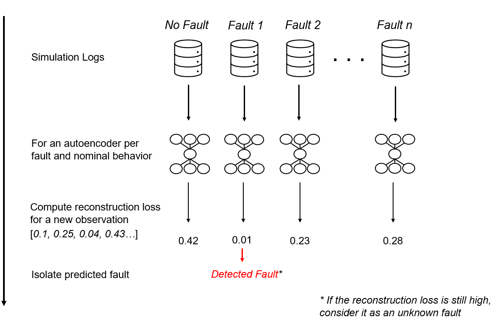
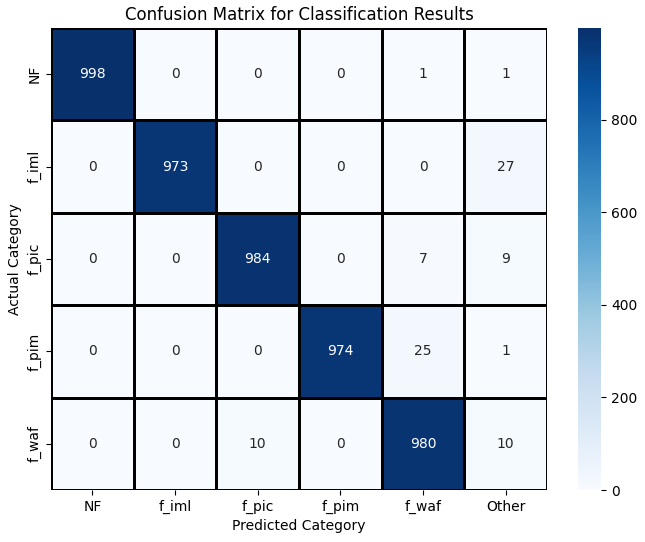

# Reconstruction-Based Fault Classification

**TLDR: use an ensemble of autoencoders to detect and isolate a fault in a cyber-physical system**

<picture style="align: center; padding-bottom: 3mm;">
  
</picture>

This repository contains code required to participate in the [LiU-ICE DeluXe Diagnosis Competition](https://vehsys.gitlab-pages.liu.se/dx25benchmarks/liuice/liuice_index).

### High-level overview

1. Scale the data using standard scaler
2. Train an autoencoder to reconstruct samples from data logs of each fault and of the nominal behaviour
3. Compute reconstruction losses with trained autoencoder, and 98 percentile of reconstruction losses serves as an anomaly treshold (last step)
4. For each new sample, compute reconstruction losses with all autoencoders
5. Fault is isolated with the smallest loss
6. However, fault might also be of an unknown type. If the reconstruction loss is above anomaly threshold for its autoencoder (98 percentile), treat the fault as "Unknown fault"

## Structure and Results

Install:
```commandline
pip install -r requirements.txt
```

[train_aes.py](train_aes.py) is used for training of autoencoders for all faults. It also computes mean, stddev, and 98 percentiles of reconstruction losses and saves it into [trained_models](trained_models).

[ae_based_diagnosis.py](ae_based_diagnosis.py) implements the competition interface.

[evaluation.py](evaluation.py) evaluates the approach, and outputs following confusion matrix:

<picture style="align: center; padding-bottom: 3mm;">
  
</picture>

Category *Other* shows the classification rate of faults to unknown faults. **Note that for other we do not have actual samples**.

**Time statistics:** Average time 0.0011 Max time 0.0039 (Intel(R) Core(TM) Ultra 5 125U (14 CPUs), ~1.3GHz)

